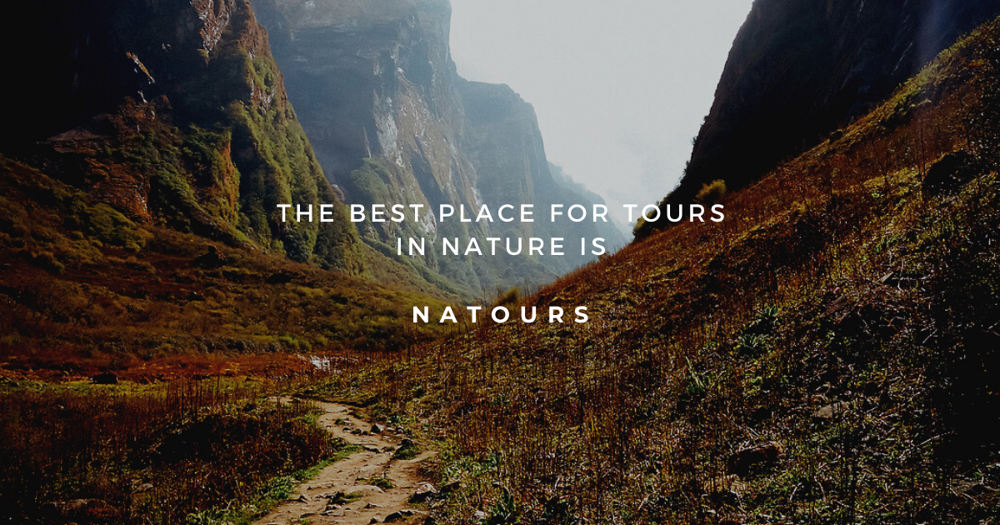

# NATOURS

## Tabel of contents

- [General info](#general-info)
- [Technologies](#technologies)
- [Setup](#setup)
- [Demo](#demo)
- [Features](#features)
- [Status](#status)
- [Sources](#sources)
- [Contact](#contact)

## General info

Exciting tours for adventurous people.
This project is being developed in progress of course **_Advanced CSS and Sass_**.
Its purpose is to learn the basics of the frontend and this website was created to show this knowledge in practice.

## Technologies

- HTML 5
- SASS -SCSS
- BEM
- RWD
- Webpack
- CSS amimation

## Setup

In console type `npm install` then choose one of the options:

`npm run start` - runs development mode

`npm run build` - runs build process for production

`npm run publish` - runs build process and publish the page using `gh-pages` branch

## Demo

Demo version of this project: [Link](https://skalutki.github.io/Natours/)

## Features

- Smooth animation
- 3d effect on card movement
- cool CSS hamburger menu
- video background
- individual radio buttons
- RWD
- desktop first

## Status

The project is finished.

## Sources

This web is inspire by Jonas Schmedtmann and tutorial [Advanced CSS and SASS](https://www.udemy.com/course/advanced-css-and-sass/)

## Contact

Created by skalutki <skalutki@gmail.com> - feel free to contact me!
